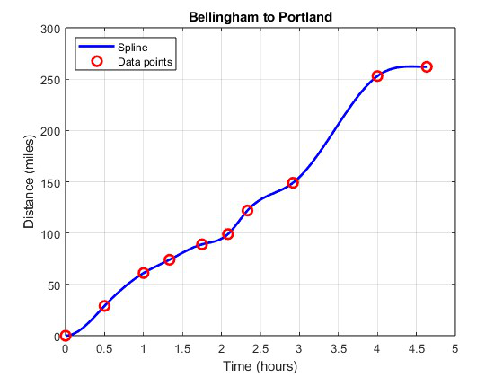

# Polynomial Interpolation and Cubic Splines (MATLAB)

**Quarter:** Spring 2025  

In this project we implemented two classical numerical methods for function approximation and data fitting. The first uses polynomial interpolation with Newton's divided differences to build a cosine calculator accurate to 10 decimal places, then extends it from a local interval to all real numbers using symmetry properties of cosine. The second fits a cubic spline, a piecewise smooth curve made of connected cubic polynomials, to real travel time and distance data from a Bellingham to Portland road trip.

## Contents

| File                     | Description                                                                                                                                                                                                                                              |
| ------------------------ | -------------------------------------------------------------------------------------------------------------------------------------------------------------------------------------------------------------------------------------------------------- |
| `cosine_interpolation.m` | Builds a cosine approximation accurate to 10 decimal places using Newton's divided differences on Chebyshev nodes over $[0, \pi/2]$, then extends to all real numbers using cosine symmetry and periodicity. Also compares performance against evenly spaced nodes. |
| `cubic_spline.m`         | Fits a clamped cubic spline to travel time and distance data from a Bellingham to Portland road trip and plots the smooth interpolating curve with the original data points marked.                                                                        |

## Results

### Problem 1: Cosine Interpolation

The program first computes the minimum number of interpolation points needed to guarantee 10-decimal-place accuracy, builds the polynomial over $[0, \pi/2]$, then extends it to all real numbers using the identities $\cos(-x) = \cos(x)$ and $\cos(x + 2\pi) = \cos(x)$.

**Chebyshev nodes**

x = 0, 0.5, 1, 1.5:
```
x      P(x)               cos(x)             |Error|
0.0    0.999999999217     1.000000000000     7.83e-10
0.5    0.877582562060     0.877582561890     1.69e-10
1.0    0.540302306397     0.540302305868     5.29e-10
1.5    0.070737200976     0.070737201668     6.92e-10
```

x = -20, -5, 10, 100:
```
x        P(x)               cos(x)             |Error|
-20.0    0.408082060986     0.408082061813     8.28e-10
 -5.0    0.283662185369     0.283662185463     9.39e-11
 10.0   -0.839071528535    -0.839071529076     5.41e-10
100.0    0.862318872145     0.862318872288     1.43e-10
```

![Chebyshev on [0, pi/2]](figures/chebyshev_local.png)

![Chebyshev on [-5, 10]](figures/chebyshev_extended.png)

---

**Evenly spaced nodes**

x = 0, 0.5, 1, 1.5:
```
x      P(x)               cos(x)             |Error|
0.0    1.000000000000     1.000000000000     0.00e+00
0.5    0.877582562127     0.877582561890     2.37e-10
1.0    0.540302305809     0.540302305868     5.89e-11
1.5    0.070737197369     0.070737201668     4.30e-09
```

x = -20, -5, 10, 100:
```
x        P(x)               cos(x)             |Error|
-20.0    0.408082061664     0.408082061813     1.49e-10
 -5.0    0.283662186184     0.283662185463     7.21e-10
 10.0   -0.839071529119    -0.839071529076     4.25e-11
100.0    0.862318872462     0.862318872288     1.74e-10
```

![Even-spaced on [0, pi/2]](figures/evenspaced_local.png)

![Even-spaced on [-5, 10]](figures/evenspaced_extended.png)

---

**Chebyshev vs evenly spaced: discussion**

The results support known advantages of Chebyshev nodes in polynomial interpolation. On $[0, \pi/2]$, both methods produced small errors, but Chebyshev nodes consistently performed slightly better. For example, at $x = 1.5$, the Chebyshev method had an error of $6.92 \times 10^{-10}$, compared to $4.30 \times 10^{-9}$ with evenly spaced nodes. Over a broader domain the difference became more apparent: at $x = -5$, Chebyshev nodes gave an error of $9.39 \times 10^{-11}$, while evenly spaced nodes gave $7.21 \times 10^{-10}$.

These differences reflect the tendency of high-degree polynomials with evenly spaced nodes to exhibit polynomial wiggle, large unnecessary oscillations especially near interval boundaries. Chebyshev nodes counteract this by concentrating more interpolation points near the edges of the interval. In practice, Chebyshev spacing yields more stable and reliable interpolation across both small and large intervals.

### Problem 2: Cubic Spline

A cubic spline fit to GPS travel data from a Bellingham to Portland road trip, with clamped boundary conditions (starting and ending speed fixed at zero). The curve passes exactly through all 10 data points and is smooth throughout.



## Running

Each script can be run directly from MATLAB.

```matlab
>> cosine_interpolation
>> cubic_spline
```

To switch between Chebyshev and evenly spaced nodes in `cosine_interpolation.m`, set `use_chebyshev = true` (line 34) to use Chebyshev nodes, or leave it as `false` for evenly spaced.
